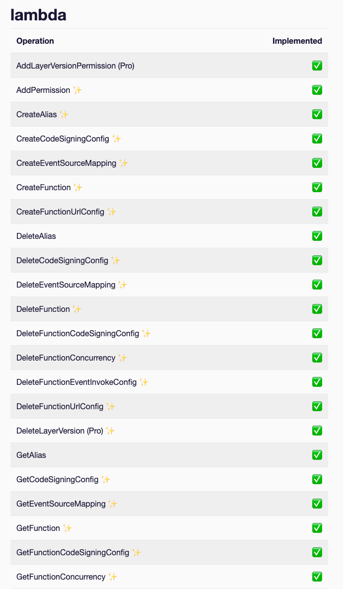
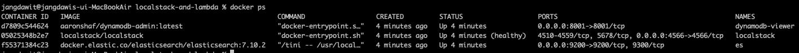
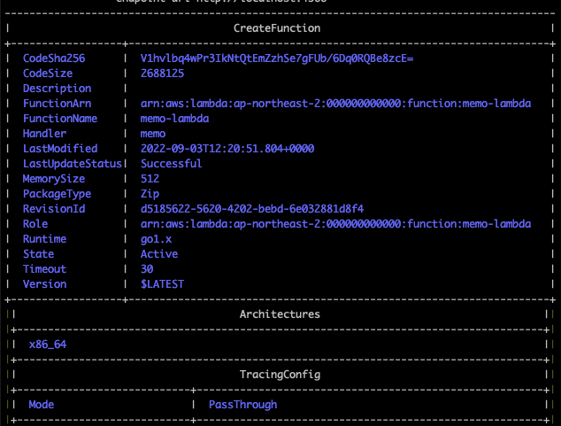
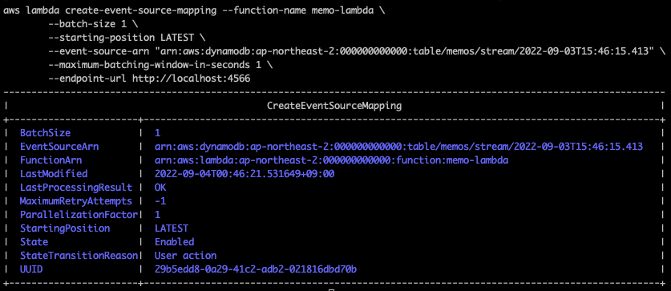
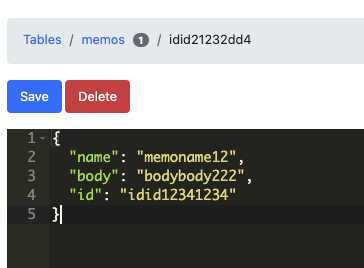
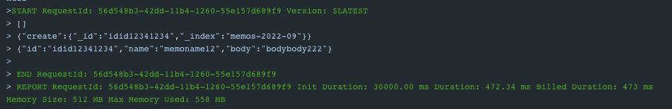
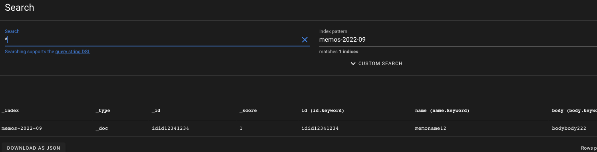
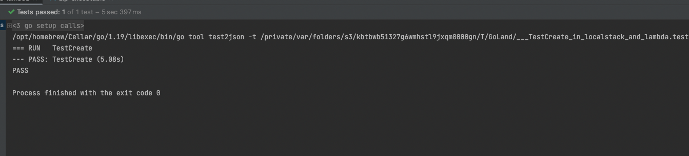

## 서론

개발하다보면 가용성이나 여타 다른 서비스의 영향을 받지 않기 위해 서버리스 운영을 고려하곤 한다.

AWS의 lambda 는 standalone 에 비해 상대적으로 개발하기 간편하면서 다른 인프라 의존성을 신경쓸 일이 적고(DB 접근같은 문제는 차치하더라도) 필요에 따라 훨씬 유연하게 개발할 수 있기 때문에 특정 상황에서 많은 장점을 가지고 있다.

람다는 개발하기(정확히는 구현하기) 간편하다는 장점이 있지만 한편으로는 디버깅에 애를 먹곤 한다. 코드에 수정이 가해지면

- 저장 및 압축
- awscli 혹은 웹 콘솔을 통한 배포
- awscli를 통한 invoke 혹은 웹 콘솔의 테스트 기능을 사용하여 테스트

를 반복해야 한다. HTTP Request 를 처리하는 람다라면 몰라도 dynamodb stream 같은 특수한 트리거 같은 경우에는 훨씬 디버깅이 어려워 질 수 있다.

가장 **간편한** 해결책은 프레임워크를 사용하는 것이다. 이미 이러한 문제들이 제기되었고 람다 혹은 서버리스 개발을 도와주는 [serverless](https://www.serverless.com/) 라는 프레임워크가 이미 있다! 배포 시의 권한 문제들이 조금 있지만 충분히 간편하고 serverless.yml 파일만 잘 관리해주면 매우 유용하게 사용할 수 있다. 프레임워크 의존성을 늘리는 일이 항상 최고의 선택은 아니지만 한정된 리소스와 개발 환경이라면 언제나 최선의 선택이 될 수 있다고 생각한다. 좋은게 좋은거지!

필자도 사실 해당 프레임워크를 사용하고 싶었지만 해당 프레임워크가 개발 당시 golang + dynamodb stream 을 제대로 지원하지 않는 이슈가 있었어서 눈물을 머금고 다른 방법을 찾아야 했었다. 그러던 도중 찾은 것이 localstack이고, 이를 통해 어떻게 개발했는지 서술한다.

## Localstack 이란?

[Localstack](https://localstack.cloud/)은 클라우드 환경(주로 AWS)을 로컬에서 직졉 재현하여, 테스트 가능하게 해주는 오픈 소스이다. 사용할 수 있는 AWS 서비스로는 [여기](https://docs.localstack.cloud/aws/feature-coverage/)에 나열되어 있는데, 무료로도 대부분의 다양한 서비스들을 사용할 수 있고 한달에 28$ 내고 사용하는 Pro는 훨씬 더 다양한 기능을 사용할 수 있다. Localstack 을 몰랐다면 이 글을 통해 알게 된 것 만으로도 수확이 있다!

{: width="50%"}
_lambda features_

이번에 눈여겨 볼 부분은 [lambda](https://docs.localstack.cloud/localstack/coverage/#lambda)와 dynamodb 및 stream 이고 람다의 경우 기본적인 기능은 물론 Pro 를 사용하면 Layer 등을 붙여볼 수도 있다.

## 목표 및 개발 환경

### 목표

- 로컬에서 개발 및 트리거에 따른 함수 invoke
- 로직에 변화가 생기면 hot reload 까지는 아니어도, 빠르게 변경사항 반영
- e2e 테스트 코드 작성
- 상단 모든것을 docker-compose로 묶기

### 메모 검색을 위한 스트림 처리

dynamodb에 memo 들이 들어오고, 이 메모들을 스트림으로 받아서 elasticsearch에 넣는 작업을 하는 람다를 작성한다.

### 개발 환경

- Go 1.19
- Docker 20.10.8 (with compose 1.29.2)
- ARM Mac 12.4 Monterey
- Elasticsearch 7.10.2
- Localstack
- awscli 2.7.28

## 핸들러 작성

_전체 소스코드는 [이 레포지토리](https://github.com/david02324/blog-examples/tree/main/localstack-and-lambda)에 있다._

먼저 아주 간단한 람다 핸들러를 작성한다.

```go
package main

import (
	"fmt"
	"github.com/aws/aws-lambda-go/events"
	"github.com/aws/aws-lambda-go/lambda"
	"localstack-and-lambda/elasticsearch"
	"localstack-and-lambda/model"
)

func HandleRequest(request events.DynamoDBEvent) {
	var memos []model.Memo

	for _, record := range request.Records {
		if record.EventName == "INSERT" {
			image := record.Change.NewImage
			memo := model.NewMemoFromDDBImage(image)

			memos = append(memos, *memo)
		}
	}

	client, err := elasticsearch.NewESClient()
	if err != nil {
		fmt.Println(fmt.Errorf("elasticsearch client error %w", err))
	}

	err = client.BulkCreate(&memos)
	if err != nil {
		fmt.Println(fmt.Errorf("elasticsearch bulk error %w", err))
	}
}

func main() {
	lambda.Start(HandleRequest)
}
```

요청이 들어오면 INSERT Item 들만 모아서 한번에 es에 넣어준다.

## docker-compose.yml 작성

이제 docker-compsoe.yml 파일을 작성한다. 컨테이너는 3개로, **localstack** 과 **dynamodb admin**, **elasticsearch** 이다. DyanmoDB Admin은 로컬 개발할때 DDB 관리하기 편리하여 추가하였다.

```yml
version: "3.3"

services:
  localstack:
    container_name: localstack
    image: localstack/localstack
    ports:
      - "4566:4566"
    environment:
      DEBUG: 1
      SERVICES: lambda,apigateway,s3,dynamodb,dynamodbstreams
    volumes:
      - "${TMPDIR:-/tmp/localstack}:/tmp/localstack"
      - "/var/run/docker.sock:/var/run/docker.sock"

  dynamodb-admin:
    image: "aaronshaf/dynamodb-admin:latest"
    ...

  elasticsearch:
    image: docker.elastic.co/elasticsearch/elasticsearch:7.10.2
    ...
```

localstack 도커 컨테이너는 별 설정 없이 상당히 직관적으로 띄울 수 있다. 포트는 보통 4566 을 사용한다.

- DEBUG: 콘솔에 다양한 디버깅 로그를 찍을지의 여부이다.
- SERVICES: 활성화 할 서비스이다. 지금은 lambda, apigateway, s3(람다 업로드 위해 필요) 그리고 dynamodb 및 stream을 사용한다
  - 다른 서비스들에 대해서는 awscli 의 네이밍을 따르며 [여기](https://docs.aws.amazon.com/cli/latest/reference/index.html#available-services)에서 확인할 수 있다.

다른 환경변수는 [여기](https://docs.localstack.cloud/localstack/configuration/)서 자세하게 확인할 수 있다. 엄청나게 다양한 환경변수들이 존재하며, 자세한 설명들이 나와 있다.

이제 터미널에서 `docker-compose up` 을 통해 실행시킨다.



그러면 이미지를 다운받고 조금 뒤 이렇게 컨테이너가 올라간다. 이제 로컬 컴퓨터에서 AWS 서비스가 올라가 있다. 해당 로컬스택을 사용하는 방법은, aws-cli 를 통해서 할 수 있다. 이때 `endpoint-url` 옵션을 `localhost:4566` 으로 주기만 하면 된다.

이후 컨테이너를 내리고 올리는데 계속 터미널을 사용하면 불편하므로, Makefile 을 하나 작성한다. 이후에도 이 Makefile에 명령어를 추가하고 편리하게 사용할 수 있다.

그전에 먼저 awscli 가 없다면 설치하고(`brew install awscli`), aws config 설정이 되어 있지 않다면 설정한다(`aws configure`)

> config 설정 시 default output을 table 로 설정해두면 예쁜 output 을 볼 수 있다.

```makefile
init: stop zip-executable build start create-table

start:
	docker-compose -f docker-compose.yml up -d
	sleep 2 # grace time

stop:
	docker-compose -f docker-compose.yml down --remove-orphans

zip-executable:
	zip memo.zip memo

build:
	GOARCH=amd64 GOOS=linux go build -ldflags="-s -w" -o memo main.go

create-table:
	aws dynamodb create-table --cli-input-json file://memos-table.json --endpoint-url http://localhost:4566
```

매 재시작마다 빌드 및 DDB 테이블 생성까지 함께 돌아갈 수 있도록 설정했다. 마이그레이션 파일은 [레포지토리](https://github.com/david02324/blog-examples/blob/main/localstack-and-lambda/memos-table.json)에서 확인할 수 있다.

## 로컬스택에 배포하기

준비는 완료되었다. 이제 로컬스택에 람다를 배포하고, ddb stream을 람다와 이어주는 이벤트를 매핑해주면 된다.

당연하게도 로컬스택에 배포 해봤자 로컬스택을 종료하고 다시 켜면 모든 데이터가 날아가기 때문에 재시작마다 다시 등록해줘야 한다. 이또한 Makefile에 등록하여 한번에 가능하도록 할 것이다.

### 람다 배포하기

Makefile에 다음 항목을 추가한다.

> awslocal 패키지를 설치한다면 맨 마지막 `endpoint-url` 옵션을 주지 않고 사용할 수 있다.

```makefile
deploy-lambda:
	aws lambda create-function \
		--function-name memo-lambda \
		--runtime go1.x \
		--handler memo \
		--timeout 30 \
		--memory-size 512 \
		--zip-file fileb://memo.zip \
		--role arn:aws:lambda:ap-northeast-2:000000000000:function:memo-lambda \
		--endpoint-url http://localhost:4566
```


_table response_

혹시나 잘못 배포하거나 이상하다면 `delete-function` 명령어를 통해 제거할 수 있다. 이것도 나중을 위해 먼저 추가해 놓는다.

```makefile
remove-lambda:
	aws lambda delete-function \
	--function-name memo-lambda \
	--endpoint-url http://localhost:4566
```

일단 이러면 람다 배포는 끝이다. 이제 스트림 매핑을 해야 한다.

### DynamoDB Stream을 람다와 매핑하기

```makefile
create-event-source-mapping:
	aws lambda create-event-source-mapping --function-name memo-lambda \
	--batch-size 1 \
	--starting-position LATEST \
	--event-source-arn $(shell aws dynamodb describe-table --table-name memos --endpoint-url "http://localhost:4566" --output json --query 'Table'.'LatestStreamArn') \
	--maximum-batching-window-in-seconds 1 \
	--endpoint-url http://localhost:4566

```

스트림 arn이 테이블 생성 시점에 따라 바뀌어서 중간에 한번 가져와 주어야 하는 번거로움이 있다.


_table response_

실행하면 매핑도 완료되었다.



이제 [DynamoDB Admin](http://localhost:8001) 에 가서 메모를 집어넣어 본다.



그리고 도커 로그를 보면 잘 Invoke 된 것을 확인할 수 있다(필자는 로그를 찍었다)



실제로 Elasticsearch도 확인해보면 잘 들어가 있다.

이로써 개발완료! 퇴근하면 좋겠지만, E2E 테스트라는 과제가 남았다.

## E2E 테스트 작성하기

E2E 테스트는 대단하게는 아니고, DynamoDB Insert 로 인해 Elasticsearch Index 가 생성되었는지만 검증하면 된다. 간단하게 다음과 같이 작성해볼 수 있겠다.

```go
func TestCreate(t *testing.T) {
	dummyId := uuid.New().String()
	memo := map[string]string{"id": dummyId, "name": "dummyName", "body": "dummyBody"}
	index := elasticsearch.GetMemoESIndex()
	client, _ := elasticsearch.NewESClientWithAddress("http://localhost:9200")

	insertToDDB(memo)
	time.Sleep(time.Second * 5)

	doc := client.GetItem(index, dummyId)
	sourceDoc := doc["_source"].(map[string]any)

	assert.True(t, doc["found"].(bool))
	assert.Equal(t, memo["id"], doc["_id"])
	assert.Equal(t, memo["name"], sourceDoc["name"])
	assert.Equal(t, memo["body"], sourceDoc["body"])
}
```



## 추가적인 디테일

목표 사항중 '로직에 변화가 생기면 hot reload 까지는 아니어도, 빠르게 변경사항 반영' 이 있었는데, 이는 Makefile 에서 하나의 항목을 추가하면 된다.

```makefile
redeploy: remove-lambda zip-executable build deploy-lambda
```

로컬스택을 내렸다 올리지 않고 람다 로직의 변경사항만 반영할 수 있다.

# 마무리

이렇게 아주 간단하게 로컬에서 dynamodb 및 dynamodb stream 을 통해 람다를 invoke 하고, 이를 통해 elasticsearch 에 생성하는 과정까지 거쳤다. 실제 환경에 배포한다면 aws cli 명령어의 값들을 환경 변수로 빼고 env 값을 통해 배포를 관리할 수 있을 것 같다.

장점은 프레임워크 의존성이 줄어든다는 점, 권한을 좀더 세분화하여 배포할 수 있다는 점 등이 있지만 단점으로는 aws cli 커맨드에 엄청 신경을 써여 한다.

필요한 누군가에게 도움이 되었길 바란다.

# References

- 내 뇌와 내가 작업한 것들
