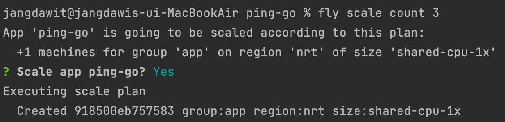

_fly.io_

# 서론

사이드 프로젝트 혹은 해커톤 등에서 열심히 코드를 작성하고 배포할 때가 되면, 항상 어떤 플랫폼 혹은 서비스를 이용하여 배포하여야 더 경제적인지, 더 나아간다면 장기적으로 관리하기 쉽고 Scale in/out 하기 쉬운지를 고려하게 된다. AWS를 사용하자니 AWS 에서 제공하는 방대한 기능은 사실 거의 필요 없고, 혹여나 잘못된 리소스 관리로 요금 폭탄을 맞을지 두려움에 떨게 된다. 이러한 고민을 한번이라도 해본 개발자라면, 작은 인스턴스에 한에 완전 무료를 제공하는 Heroku 의 이름을 들어봤을 것이다.

그러나 Heroku 가 정책을 변경하면서, 더이상 완전 무료로 본인이 만든 사이드 프로젝트를 배포할 수 없게 되었다. 그 대안책으로 떠오른 PaaS 로 [fly.io](https://fly.io)가 있다.

본 포스트에서는 필자가 직접 사이드 프로젝트를 구성하면서 도커 파일 작성, fly.toml 작성, development, production 환경 분리 배포, Scale-out, 더 나아가 단순 VM 뿐만 아니라 fly.io 에서 제공하는 Upstash redis 및 LiteFS 에 대해서도 간단히 소개한다.

## 왜 fly.io 인가?

Heroku 를 버리고 다른 플랫폼들을 함께 찾아보고 있을 때, 내가 fly.io 에 가장 큰 매력을 느꼈던 점들은 다음과 같다.

- 작은 인스턴스 **3개**에 대한 **평생 무료** 제공(카드는 등록해야함)
- 도커 컨테이너를 통한 아주 간편한 배포와 직관적인 fly.toml 파일
- 거의 모든 기능을 포함하고 있는 fly ctl
- 무료 기본 도메인 및 인증서
- 정말 쉬운 Scale in/out
- 배포만 하면 따라오는 Grafana metric
- **합리적인 가격 정책**

~~광고 아닙니다~~

여러가지를 써놓았지만, 가장 관심이 있는 부분은 역시 가격일 것이다. 23년 9월 기준 fly.io 에서 제공하고 있는 [무료 사용량](https://fly.io/docs/about/pricing/#free-allowances)은 다음과 같다.

_무료 제공량_

최대 3개의 작은 인스턴스와 160GB 의 Outbound 데이터 전송량(Inbound 는 무료)을 제공한다. 이는 작은 사이드 프로젝트를 배포하기에 아주 충분하다고 생각된다.

_추가로 23-09 기준 월 5달러 미만의 요금은 과금되지 않는다_

# 첫 배포하기

## 프로젝트 코드 작성

먼저 fly.io 에 배포할 첫 프로젝트 코드를 작성한다. 본 포스트의 취지에 맞게 필자는 아주 간단한 수준의 ping API 를 받는 ping-go 어플리케이션을 Golang 으로 작성했다.

패키지 다운받는 과정을 Dockerfile 에 포함하기 위해 gin 프레임워크를 사용하여 작성했다. Go 프로젝트를 하나 생성하고 다음 명령어를 통해 gin 의존성을 설치한다.

`go get -u github.com/gin-gonic/gin`

이후 아주 간단한 수준의 ping API 를 받는 코드를 main.go 에 작성했다.

```go
package main

import (
	"github.com/gin-gonic/gin"
	"net/http"
)

func main() {
	router := gin.Default()

	router.GET("/ping", func(c *gin.Context) {
		c.String(http.StatusOK, "pong")
	})
	
	router.Run(":8080")
}
```

빌드 후 실행 파일을 실행해 보면 `/ping` 요청에 대해 잘 응답하는것을 확인할 수 있다.

_실행 모습_

## 도커파일 작성

이제 이 프로젝트를 컨테이너 위에 올려서 배포하기 위한 Dockerfile 을 작성한다.

[fly.io 공식 문서](https://fly.io/docs/languages-and-frameworks/)에서는 Docker 뿐만 아니라 다양한 런타임을 직접 배포할 수 있는 방법을 소개한다. 다만 개인적으로 배포 환경의 관리 측면에서 Docker 가 편리하다고 생각하기에 Docker 로 예시를 들었다.

```Dockerfile
FROM golang:1.19

WORKDIR /app

COPY . .

RUN go build -o main .

CMD ["./main"]

EXPOSE 8080
```

작은 Dockerfile을 하나 작성해주면 된다.

## fly ctl 설치 및 배포

이제 [fly.io](https://fly.io)에서 회원가입을 진행해주고, 카드를 하나 등록해준다.


*무료 사용량을 사용하기 위해서 카드 등록이 필요하다. 유료 사용분을 사용하려고 하면 경고가 나오기 때문에 경험상 원치 않는 과금이 진행된 적은 없었다*

_카드 등록을 마치고 hobby 플랜으로 변경된 모습_

여기까지 진행했으면, 이제 작성한 프로젝트를 배포한다. fly.io 플랫폼에서 할 수 있는 거의 모든 작업들은 `fly ctl` 을 통해 이루어진다.

MAC OS 기준 다음 명령어로 간단하게 설치할 수 있다.

```sh
# with homebrew
brew install flyctl

# without homebrew
curl -L https://fly.io/install.sh | sh
```

그 뒤 `fly auth login` 을 통해 터미널에서 fly.io 에 로그인 할 수 있다.

여기까지 진행되었다면 fly.io 를 사용할 준비는 완료되었다. 프로젝트 루트 폴더에서 다음 명령어를 실행한다.

`fly launch`

{: width="70%"}

프로젝트 이름과, 리전 등을 묻는다. 2023-09 기준 서울 리전은 없고, 가장 가까운 **Tokyo, Japan (nrt)** 리전을 선택했다.

{: width="70%"}

여기서 postgresql DB 를 바로 붙일지 묻는데, 여기서 y 를 택하면, secret 환경 변수 `DATABASE_URL` 에 postgresql 엔드포인트가 지정된다. 필요에 따라 지정하면 되겠다. 필자는 일단 붙이지 않았다.

{: width="70%"}

몇가지 선택을 완료하면 해당 선택 내용을 바탕으로 `fly.toml` 을 생성해준다. 그리고 즉시 배포할지 묻는데, y 를 택하겠다.

이후 조금 기다리면, fly.io 의 remote builder 를 통해 dockerfile 을 빌드하고, 실행해준다. 첫 배포 시 ip 를 할당해주고, 머신을 띄우느라 조금 더 오래걸린다.

{: width="70%"}

배포가 완료되면 바로 해당 어플리케이션에 진입할 수 있는 엔드포인트가 **https://{projectName}.fly.dev/** 형태로 제공된다.


접속해보면 잘 동작하는것을 확인할 수 있다.

홈페이지 대시보드에 접속해보면, 내가 배포한 프로젝트가 생성되어 있는것을 볼 수 있는데 이를 선택하면 배포한 프로젝트의 실시간 로그나 지표, 인스턴스 개수 및 스케일 등을 확인할 수 있다.


이후 배포에서는 간단하게 `fly deploy` 명령어를 사용하면 로컬 파일들을 기준으로 배포가 진행된다.

## 도메인 설정

처음 배포 시 **https://{projectName}.fly.dev/** 형태의 고정된 도메인을 받게 되는데, 원하는 도메인을 추가하기 위해서는 fly ctl 의 [fly certs 커맨드](https://fly.io/docs/flyctl/certs-add/) 혹은 홈페이지 대시보드에서 추가할 수 있다.

_홈페이지 대시보드에서 도메인 추가_

*기본적으로 부여해주는 도메인을 해제하는 방법은 찾지 못했다. 필자의 경우 기본 도메인으로 접근 시 추가한 도메인으로 리다이렉트 하는 코드를 하드코딩하는 방식으로 우회했다. 더 좋은 방법이 있다면 댓글로 남겨주시면 감사합니다!*

# 프로젝트 관리하기

드디어 프로젝트를 배포했다. 이제는 프로젝트를 유지/보수하면서 사용할 수 있는 fly.io 의 다양한 feature 들을 소개한다.

## fly.toml

프로젝트 폴더에 보면 fly.toml 파일이 생성되어 있을 것이다. 이 파일은 `fly deploy`를 실행했을 때 보게 될 설정 파일이다. 따로 `--config` 플래그를 사용하지 않으면 기본 `fly.toml` 을 바라보게 된다.

```toml
# fly.toml app configuration file generated for ping-go on 2023-09-30T07:03:49+09:00
#
# See https://fly.io/docs/reference/configuration/ for information about how to use this file.
#

app = "ping-go"
primary_region = "nrt"

[build]

[http_service]
  internal_port = 8080
  force_https = true
  auto_stop_machines = true
  auto_start_machines = true
  min_machines_running = 0
  processes = ["app"]
```

쓸만한 몇가지 옵션들을 보자면,

- [env](https://fly.io/docs/reference/configuration/#the-env-variables-section)
  - 실행 환경 변수를 지정한다.
  - 보통 git 저장소에 fly.toml 을 올리기에 이 섹션에 민감한 정보는 포함하면 안된다. 민감한 정보는 fly secrets 를 통해 주입하는것이 권장된다.
- [build](https://fly.io/docs/reference/configuration/#the-build-section)
  - 빌드할 때 사용할 info 를 저장한다.
  - dockerfile, dockerignore, docker build arg 등을 지정할 수 있다.
- [deploy](https://fly.io/docs/reference/configuration/#the-deploy-section)
  - [strategy 옵션](https://fly.io/docs/reference/configuration/#picking-a-deployment-strategy)을 통해 배포 시 전략을 택할 수 있다! rolling, immediate, canary, bluegreen 이 있다.
  - 기본 rolling 배포 전략이 수행된다.
- [processes](https://fly.io/docs/reference/configuration/#the-processes-section)
  - 인스턴스 별 역할이 다를 때, 혹은 아예 다른 프로세스를 올려야 할 때 사용한다.
  - 예를 들어 cron 만을 수행하는 단일 인스턴스를 API 를 담당하는 인스턴스와 분리하는 등의 경우 유용하다.
  - **scale in/out 시 따로 관리가 가능하다.**

### stage 분리 배포
fly.toml 을 이용하여 development, production stage 를 간단하게 분리할 수 있다. 먼저 fly.toml 을 development 환경에 맞추어 설정하고, prod.fly.toml 을 생성하여 production 환경에 맞게 값을 세팅한다. 그리고 배포 시 `fly deploy --config prod.fly.toml` 을 통하여 production 배포가 가능하다.

## Grafana


배포 시점부터 grafana 를 달아준다. Dashboard >> project >> Metrics >> 우 상단 Grafana 아이콘을 선택하면 들어갈 수 있다.


## Scale in/out

머신의 수평적 확장 혹은 축소가 필요할 때 `fly scale` 커맨드를 통해 진행할 수 있다.

먼저 `fly scale show` 를 통해 현재 머신 수를 확인한다.

{: width="70%"}

위에서 본 fly.toml 의 processes 를 통해 프로세스를 나누어 두었다면, 단순 app 이 아니라 프로세스별로 표시될 것이다.

아주 간단하게 그냥 기본 프로세스의 머신 수를 조정하고 싶다면 `fly scale count` 를 사용하면 된다. fly.io 에서는 3개 머신까지 무료로 제공하므로, ping-go 의 app 프로세스를 3개로 늘려보겠다.

{: width="70%"}

간단하게 `fly scale count 3` 하면 된다. 몇 초 안걸려서 새로운 인스턴스가 뜬걸 확인할 수 있다.

{: width="70%"}

간단하게는 이렇게 수동으로 scaling 할 수 있다.

다만 트래픽이나 머신의 CPU rate 등을 통해 자동으로 scaling 하려면 [fly autoscale](https://fly.io/docs/flyctl/autoscale/) 을 사용해야 하는데, 해당 기능이 fly machines V1 에서만 지원된다. 추후 V2 머신에서도 지원될 것으로 보인다.

## 환경 변수 관리

환경 변수는 fly.io 에서 두 가지 방식으로 관리할 수 있다.

먼저 민감하지 않은 환경 변수(GO_ENV 같은)는 자연스럽게 git 에 포함되도록 fly.toml 의 env 섹션을 활용하는것을 추천한다. 예를 들어 다음과 같은 형태로 추가할 수 있다.

```toml
[env]
  GO_ENV = "prod"
  HOST_NAME = "https://ping-go.jangdaw.it"
```

그리고 API_TOKEN과 같은 민감한 환경 변수의 경우 `fly secrets` 를 통해 따로 주입하는것을 추천한다.

`fly secrets --app {projectName} set ENV=VALUE` 형태로 사용할 수 있다.

{: width="70%"}

다만 secrets 을 변경하면 바로 어플리케이션이 재배포되기 때문에, 이를 피하고 싶다면 `--stage` 플래그를 추가하면 된다. 이러면 다음 배포때부터 적용된다.

환경 변수 적용 이후 `fly secrets --app {projectName} list` 를 통해 적용된 환경 변수명과 갱신 시점을 확인할 수 있다.

{: width="70%"}

# 써봄직한 기능들

단순 VM 뿐만 아니라 fly.io 에서 제공하는 다른 integration 들을 소개한다.


## Fly postgres

어플리케이션 배포에 RDBMS 하나정도는 필요할 확률이 높다. fly.io 에서는 강력한 SQL DB 인 postgresql 과의 편리한 통합을 제공한다.

*fly postgres 는 AWS 의 DynamDB 와 같은 Managed service 는 아니다. 단순 VM 배포와 동일하게 취급(과금 등)되지만, 생성 및 DB 로써의 관리를 편리하게 하기 위한 추가적인 기능들이 마련되어 있을 뿐이다. 자세한 내용은 [이곳](https://fly.io/docs/postgres/getting-started/what-you-should-know/)*

먼지 `fly postgres create` 를 통해 Postgres cluster 를 생성한다.

{: width="70%"}

개인적으로 DB 는 넉넉한 스펙을 선호하지만, 과금을 원치 않는다면 가장 작은 스펙으로 배포한다.

{: width="70%"}

DB 생성 후 접근은 크게 3가지 방법이 있다.

- **fly VM 에서는** username 과 password 를 통한 postgres url 을 사용 `postgres://{username}:{password}@{hostname}:{port}/{database}?options`
- `fly postgres connect --app {appName}` 을 통해 터미널에서 직접 접근
- `fly proxy {port} --app {appName}` 을 통해 특정 포트를 proxy 로 하여금 접근

> 필자의 경우에는 DB에 직접 쿼리날려서 볼때는 `fly postgres connect` 를 사용했고, 마이그레이션을 수행할 때는 proxy 를 사용했다.

이외 fly postgres 의 모니터링, 백업, config, 고가용성 및 복제 등 다양한 사용법에 대해서는 [문서](https://fly.io/docs/postgres/managing/)에 자세하게 나와 있다.

### 추가
- [Heroku postgres 로부터 migrate](https://fly.io/docs/postgres/getting-started/migrate-from-heroku/)

## Upstash redis

단순 key/value store 부터 pub/sub message broker 등 다양한 역할을 수행하는 Redis 또한 fly 에서 지원한다. `fly redis create` 를 통해 아주~ 간단하게 작은 무료 redis 노드를 하나 얻을 수 있다.

{: width="70%"}

이 redis 도 postgresql 과 비슷하게 `fly redis connect` 로 직접 터미널에서 접근하거나 `redis://{username}:{password}@[{ipv6 address}]:{port}` 포멧을 통해 외부에서 접근할 수 있다.

{: width="70%"}

다만 이 redis 는 upstash 에서 제공하는 redis 인스턴스로, 2023-09 기준 fly.io 의 experimental 기능이라서 production 에는 사용하는것이 권장되지 않는다.

그리고 실제로 사이드 프로젝트에서 사용했는데, 처음엔 잘되다가 얼마 지나니 connection 이 유실되는 케이스가 있었다.

## LiteFS

LiteFS 는 파일시스템 DB SQLite 를 분산 하여 응답성을 높이는 기술으로, 어플리케이션에서는 그냥 SQL DB 를 사용하는것처럼 사용하고 실제 요청이 들어왔을 때 복제된 가장 가까운 replica 에게서 조회하는 방식으로 동작한다.

필자도 실제로 fly.io 에서 이 기능을 사용해보진 않아서 이렇게 간단히 소개만 한다. 좀더 관심이 있다면 [문서](https://fly.io/docs/litefs/)에서 확인하길 바란다.

# 마무리

프로젝트 배포 및 관리를 위한 fly.io 의 주요 기능들을 전체적으로 훑어보았다. 이외에도 fly ctl 을 통해 다양한 작업들이 가능하고 문서화도 잘 되어있어서 기회가 된다면 [문서](https://fly.io/docs/)를 쭉 읽어보는것도 추천한다.